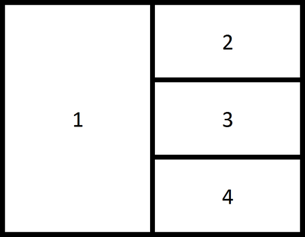
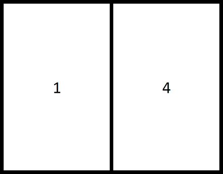

# Conditional UI Layout

## Context

In a project at work, I had to implement conditional layout for a view of a web application.
Here is a representation of the view:



The view already had two rules:

1. The card on the left pane (#1 in the image) can go full screen.
2. The card on the upper right corner (#2 in the image) can go full screen.

The new rule I had to implement was the following:

3. The card on the lower right corner (#4 in the image) can take the full height of the right pane.

As shown in this image:




The previous implementation used two variables in the controller's scope to memorize which card was expanded.
One for card #1 and another for card #2.
Then, in the template, some `ng-if`s and `ng-hide`s were used to conditionally show or hide cards based on the state of the others.
While this solution is acceptable for small changes in the UI, it shows its limits when more rules are added.

It means that the card #3 had a `ng-show` with the following conditions:

1. Card #1 is not expanded
2. Card #2 is not expanded

If continuing with this implementation, I would have to grow even more the `ng-show` expression to include:

3. Card #4 is not expanded

This is obviously not going to facilitate maintenance.

## A Single Source of Truth

The solution I came up with is that at any moment in time, I have a service that tells me which card is shown or hidden.

In that service, I have defined four possible configurations.
The two previously show above, one with card #1 in full screen, and the last with card #2 in full screen.
Each one of these configurations contain the following informations:

- For each card:
  - show
  - expand

The initial configuration object looks like this:

``` js
var configuration = {
  initial: {
    card1: {
      show: true,
      expand: false,
    },
    card2: {
      show: true,
      expand: false,
    },
    card3: {
      show: true,
      // no expand property because the card #3 is not required to expand.
    },
    card4: {
      show: true,
      expand: false,
    },
  },
  card1: { ... },
  card2: { ... },
  card4: { ... },
}
```

The `initial` property is the name of the configuration preset.
In the real implementation, there is three more properties at this level of the configuration object.
Then, the `card1`, `card2`... properties are repeated in each configuration preset.

As you can see, each card has the information it needs to know if it has to be displayed and/or expanded.
Previously, we only needed the `expand` property because if card #1 was expanded (meaning in full screen), all the others would not be displayed.
The same goes for card #2.

A card can be in one of the three states:

1. Hidden
2. Shown
3. Expanded

In binary, we would need two digit to represent all possible states (`00`, `01`, `10`, `11`).
Since the configuration object contains two boolean values for each card, we have enough place to store the three different states.
We would not have enough place with only one boolean value.
That's why there is two properties.

The service has an object that will be used by the controller, through data binding, to control the template layout.
It also exposes one method `setLayout(layoutName)` to update the values of the bound object with a simple `angular.extend()`.
As a result of data binding, calling `setLayout` will update the view.

## Usage

In the controller, use the service to get the layout configuration object and attach it to the $scope.
Then, whenever you need, call `setLayout` to update the previously attached object.
And boom! You have it! Now, in the template you have access to the current configuration object.

``` js
angular.module('myApp', [])
  .controller('myController', function ($scope, LayoutEngine) {
    $scope.cardsLayout = LayoutEngine.Layout;
    $scope.expandCard1Toggle = function () {
      if (LayoutEngine.Layout.card1.expand) {
        LayoutEngine.setLayout('default');
      } else {
        LayoutEngine.setLayout('card1');
      }
    };
    // Same for card #2 and card #4.
  });
```

``` html
<div ng-app="myApp" ng-controller="myController" layout="row">
  <div id="leftPane" flex="{{cardsLayout.card1.expand ? 100 : 50}}" layout="row">
    <card1 flex="100">
      <button ng-click="expandCard1Toggle">Expand</button>
    </card1>
  </div>
  <div id="rightPane" ng-if="!cardsLayout.card1.expand" flex="50" layout="column">
    <card2 ng-if="cardsLayout.card2.show" flex="{{cardsLayout.card2.expand ? 100 : 33}}"></card2>
    <card3 ng-if="cardsLayout.card3.show" flex="33"></card3>
    <card4 ng-if="cardsLayout.card4.show" flex="{{cardsLayout.card4.expand ? 100 : 33}}"></card4>
  </div>
</div>
```

# Conclusion

With this solution, one can control the layout of a template simply by manipulating boolean values in a service.

You want to enable full screen for card #3 ?
Create a new configuration preset in the service, the toggle method in the controller, and the conditional attributes for card #3 and that's it.
You don't have to do anything on the markup of the other cards.
